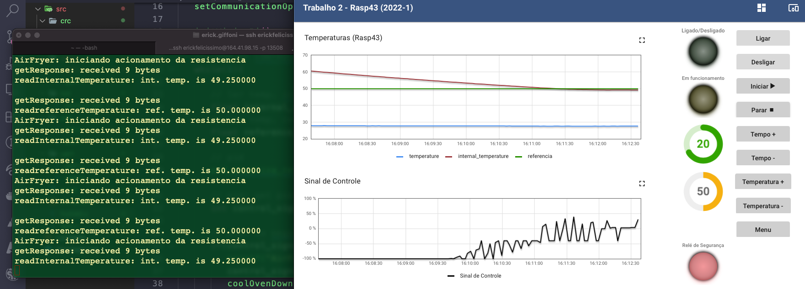
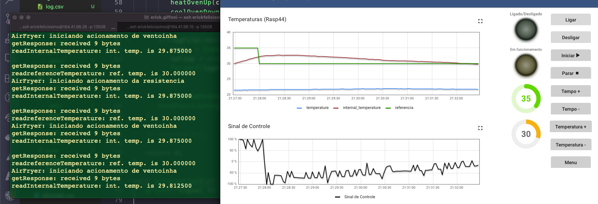

# Air Fryer

<hr>

Trabalho 2 de Fundamentos de Sistemas Embarcados - FSE | UnB

Aluno: Erick Giffoni
Matrícula: 170141161

**Código principal**: [src/fryItAll.c](./src/fryItAll.c)

<hr>

### Para compilar

1. Entre na pasta ```src``` e execute:

```console
$ ./compila.sh
```

### Para executar o programa

2. Ainda na pasta ```src```, execute:

```console
$ ./a.out
```

### Funcionalidades trabalhadas

- Solicitação e leitura da temperatura interna
- Solicitação e leitura da temperatura de referência
- Controle da temperatura interna do forno com técnica de PID
- Escrita de _logs_ do programa em arquivo no formato CSV
- Envio do sinal de controle
- Verificação do CRC nas mensagens recebidas
- Cálculo do CRC nas mensagens enviadas
- Acionamento da resistência via PWD
- Acionamento da ventoinha via PWD
- Envio do estado do sistema (ligado/desligado)
- Envio do estado de funcionamento do sistema (funcionando/parado)
- Tratamento do sinal SIGINT para interrupção do funcionamento da Air Fryer

### Gráficos

<!-- 


 -->
1. [RASP 43] Aproximando e mantendo a temperatura interna da temperatura de referência



2. [RASP 43] Diminuição da temperatura de referência: ligando a ventoinha e fazendo a
aproximação


3. [RASP 43] Aumento da temperatura de referência: início de variações entre a ventoinha
e a resistência


4. [RASP 44] Resfriando o forno e mantendo próxima as temperaturas

